# Project 1 – Active Directory OU Structure & Hybrid M365 Sync

**Course:** Entry Level IT Support Home Lab Projects for L1/L2 Engineers (Udemy, Om Luitel)
**Role simulated:** System Administrator
**Environment:** Windows Server (AD DS) in VMware Workstation, hybrid-synced to Microsoft 365 / Entra ID

## Overview
This project simulates onboarding a small organization ("LabConestoga") onto a hybrid on-premises/cloud identity setup. It covers designing an Organizational Unit structure, provisioning users and security groups, syncing on-prem Active Directory to Microsoft Entra ID via Azure AD Connect, assigning Microsoft 365 licences, joining a client machine to the domain, and validating end-user access.

## Skills demonstrated
- Active Directory Users and Computers (ADUC): OU design, user provisioning, security group management
- Azure AD Connect / hybrid identity sync (delta sync via PowerShell)
- Microsoft Entra admin center: user and sync verification
- Microsoft 365 admin center: licence assignment and management
- Client-side networking: static DNS configuration, domain join
- End-user validation: Outlook, Teams, and OneDrive access as the provisioned user

## Walkthrough

### 1. Built the OU structure
Created the top-level Organizational Units in Active Directory: Admission, HR, Students, and IT Departments.
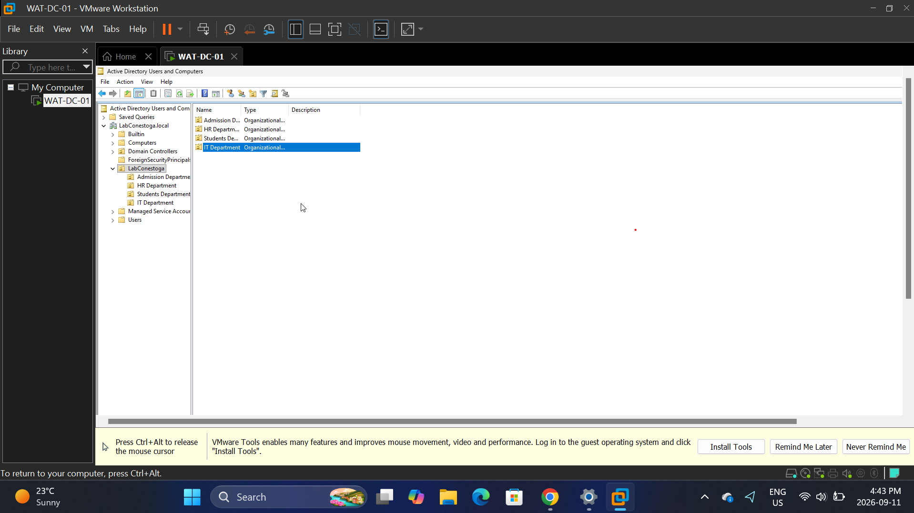

### 2–5. Provisioned users into their respective OUs
Created four user accounts and placed each into the correct department OU.

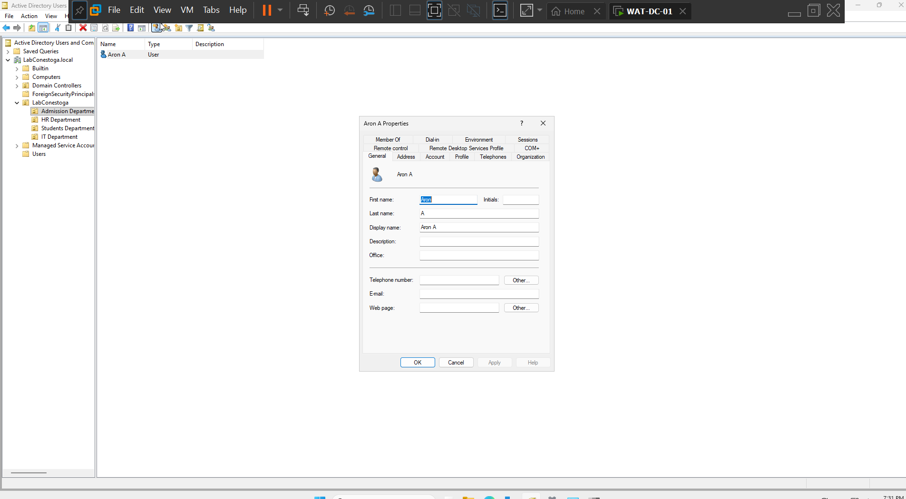
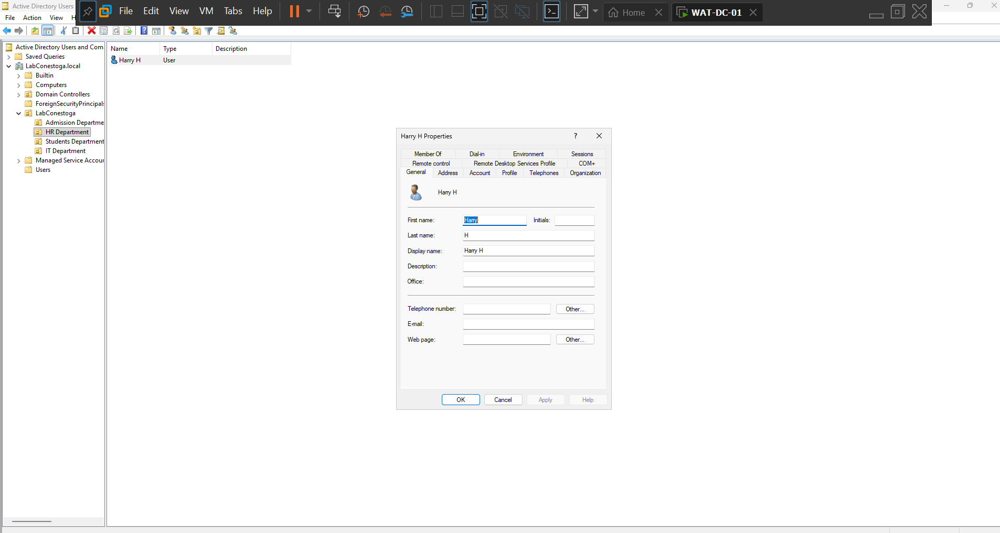

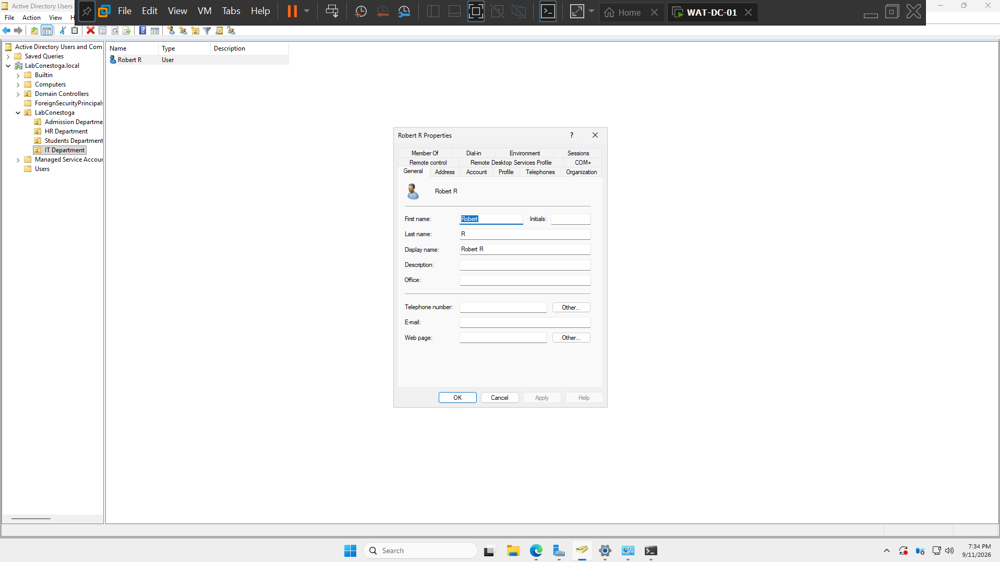

### 6. Created a security group
Set up the `Admission_Team` security group and added the relevant user as a member, for group-based access control.
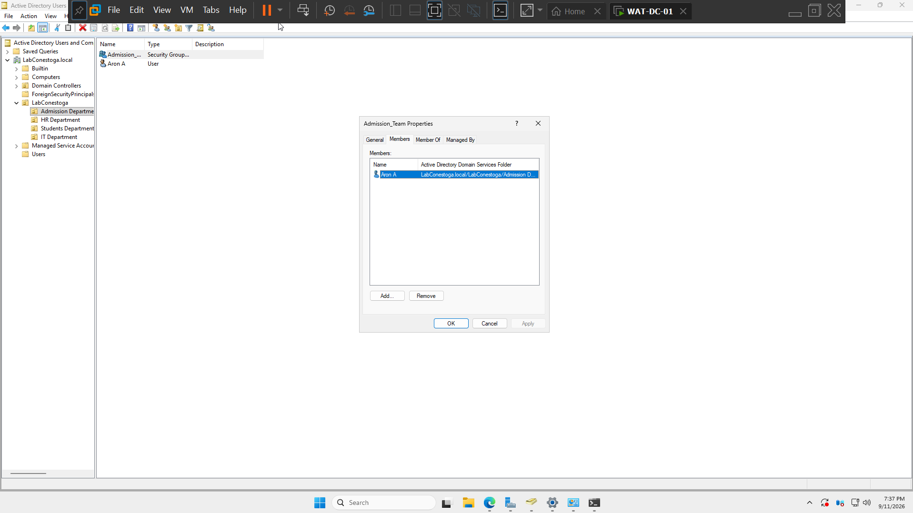

### 7. Ran an Azure AD Connect delta sync
Triggered a delta sync (`Start-ADSyncSyncCycle -PolicyType Delta`) to push on-prem AD changes up to Microsoft Entra ID.
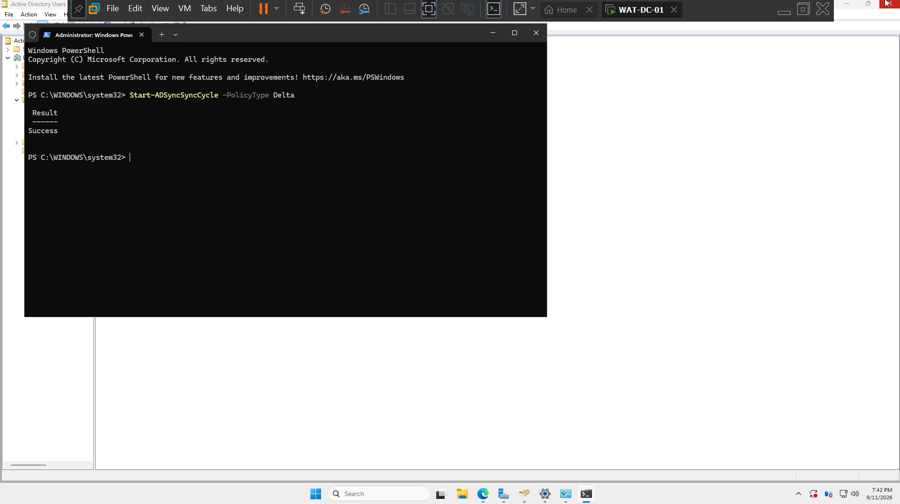

### 8. Verified users synced to Entra ID
Confirmed in the Microsoft Entra admin center that all on-prem users successfully synced to the cloud tenant.
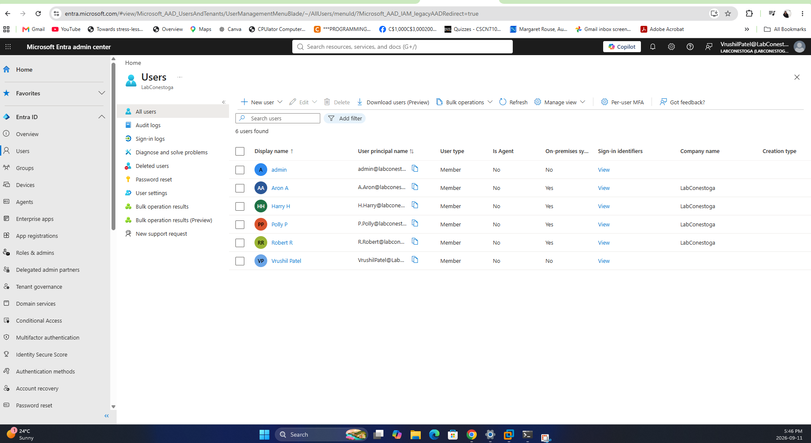

### 9. Assigned Microsoft 365 licences
Assigned a Microsoft 365 Business Premium with Copilot licence to a user in the M365 admin center.
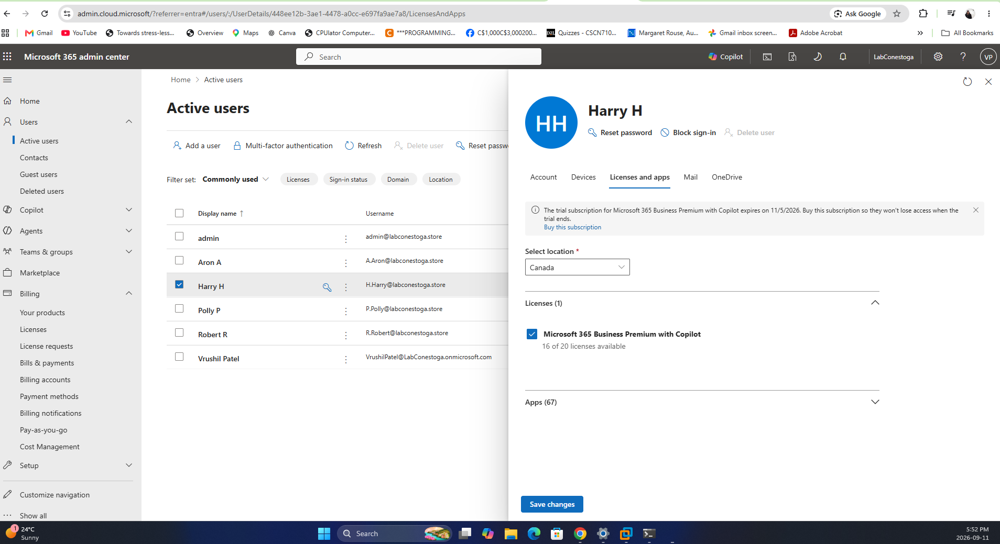

### 10. Verified licence assignment across all users
Confirmed all six users were active and licensed in the M365 admin center.
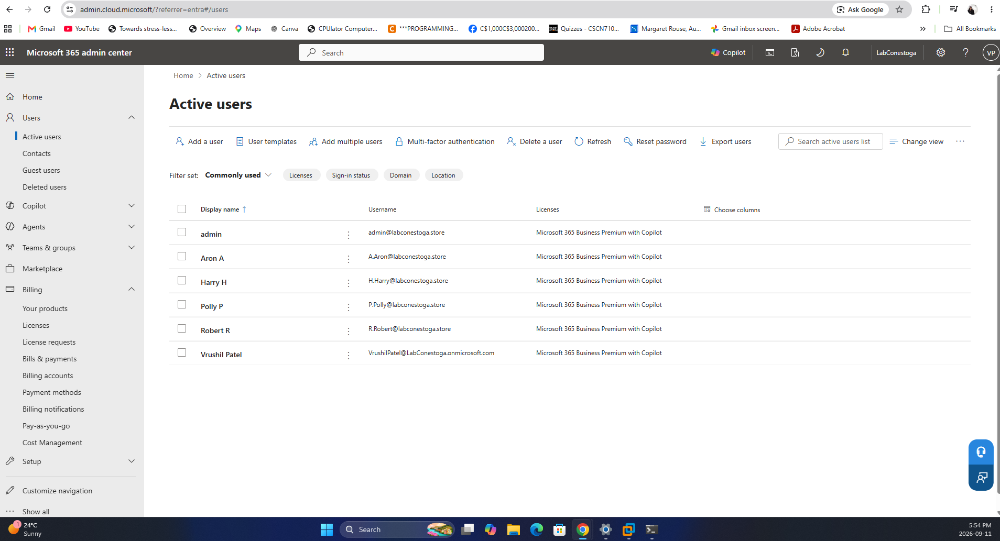

### 11. Configured client DNS
Pointed a client machine's static DNS to the domain controller so it could resolve the internal domain.
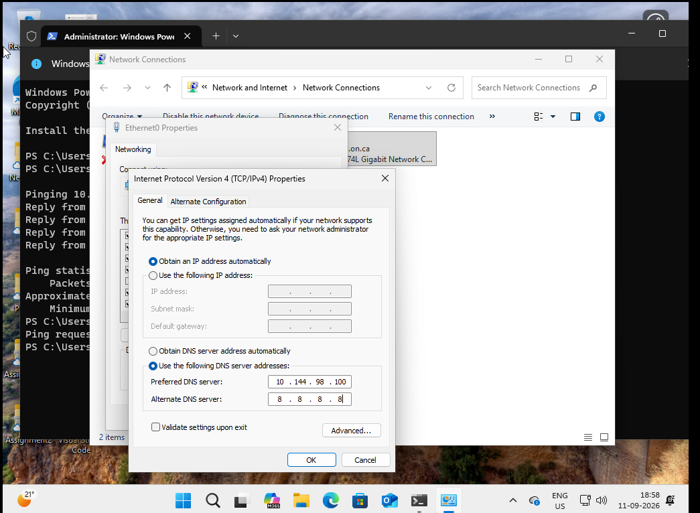

### 12. Joined the client to the domain
Successfully joined the client machine to the `LabConestoga.local` domain and validated connectivity with `ping`.
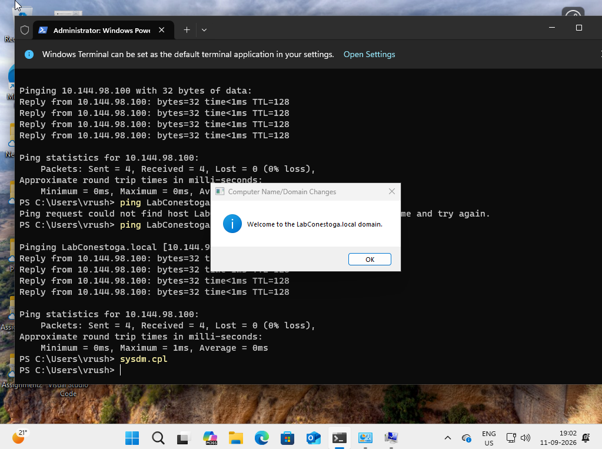

### 13. Verified user OU placement
Confirmed the correct OU assignment on the domain-joined client using `whoami /fqdn`.
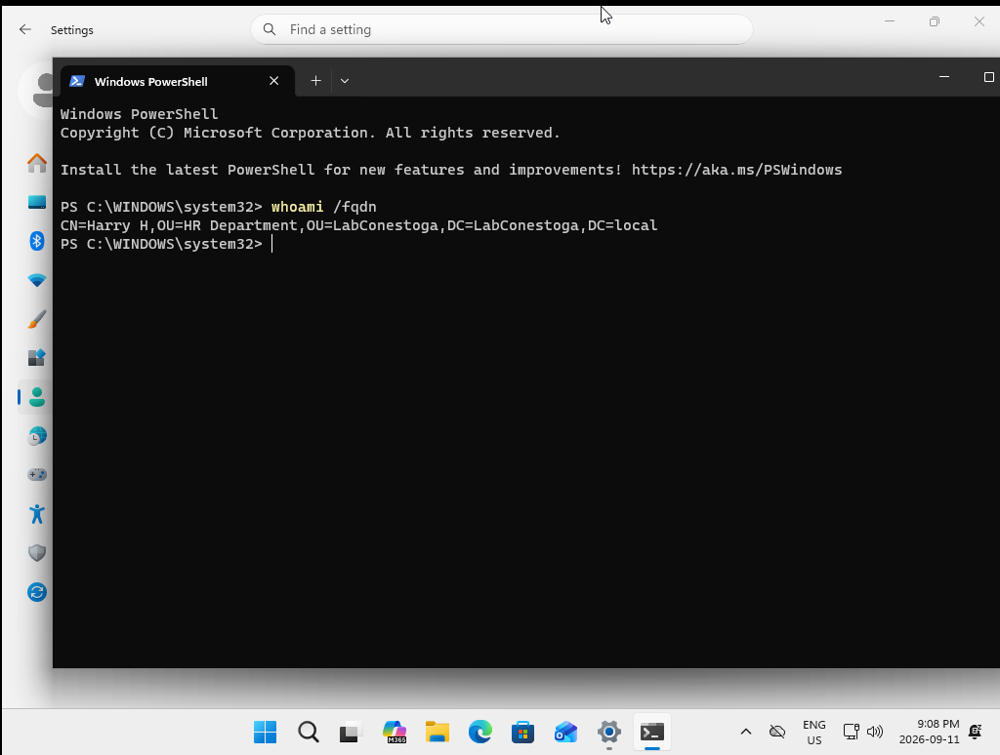

### 14. Verified Outlook mailbox access
Signed into Outlook as the domain user to confirm mailbox access was working end-to-end.
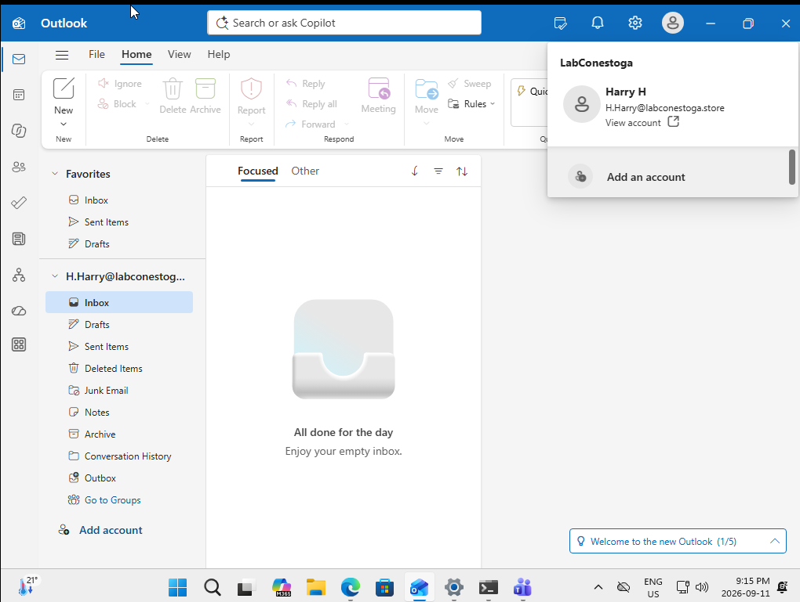

### 15. Verified Teams account access
Opened the account panel in Microsoft Teams to confirm the provisioned user was signed in correctly and had access to the LabConestoga team.
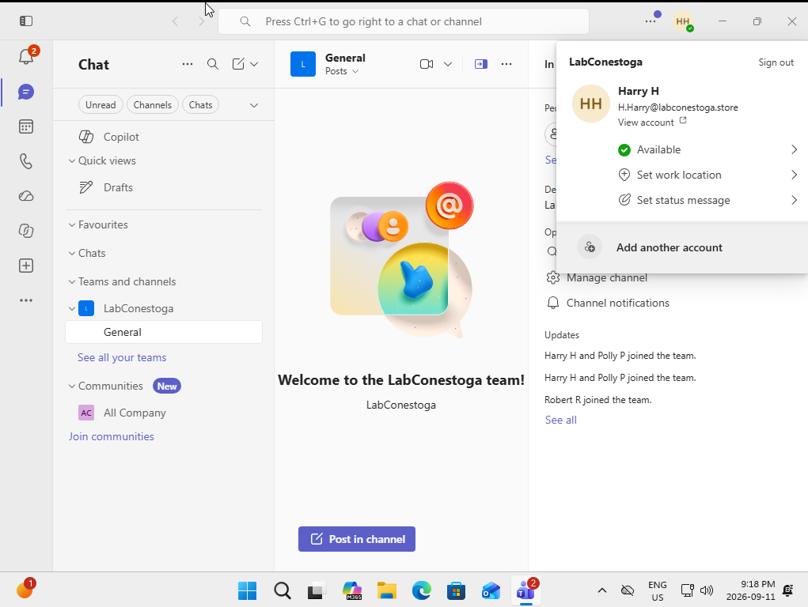

### 16. Verified OneDrive sync
Confirmed OneDrive was syncing correctly with the expected folder structure for the new user.
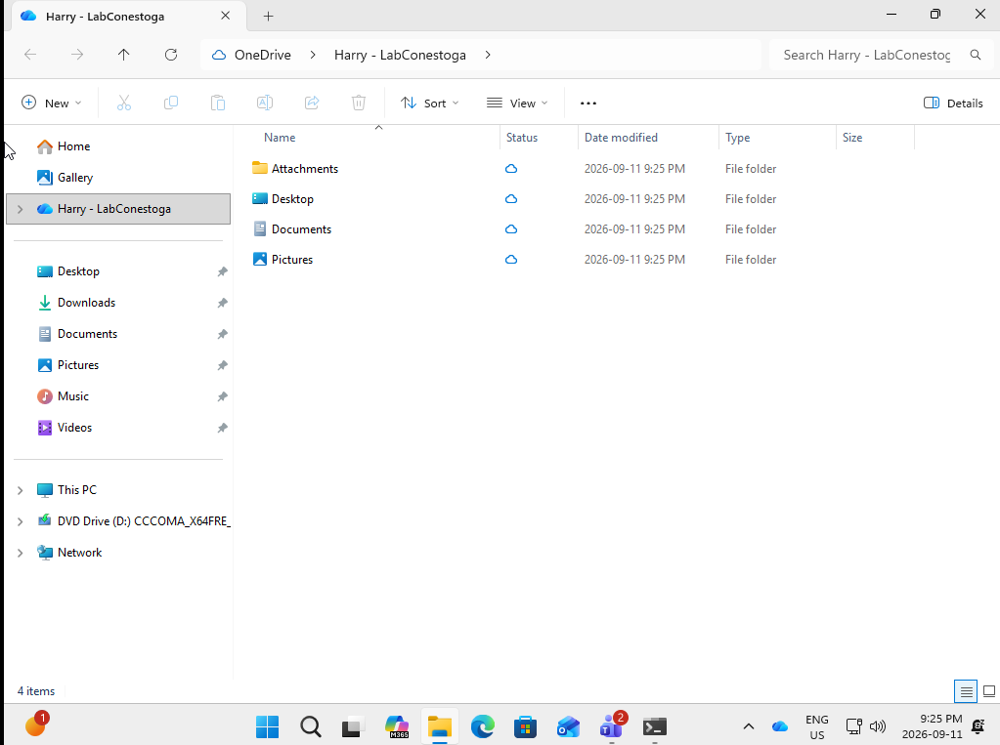

## What I learned
Setting up hybrid identity from scratch made the relationship between on-prem AD and Entra ID much clearer than reading about it — particularly how OU structure and group membership carry over, and how a delta sync propagates changes without needing a full resync. Troubleshooting the client DNS/domain-join step also reinforced how much of "AD not working" in real environments traces back to basic network configuration, and validating access from the end-user apps (Outlook, Teams, OneDrive) afterward closed the loop on confirming the whole chain actually worked.
