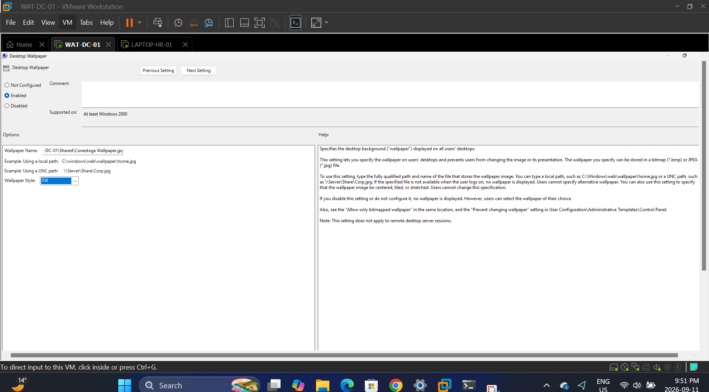
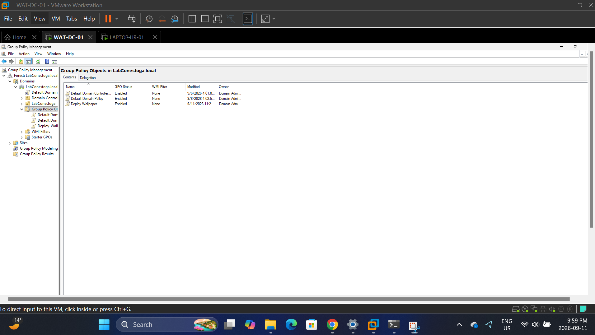
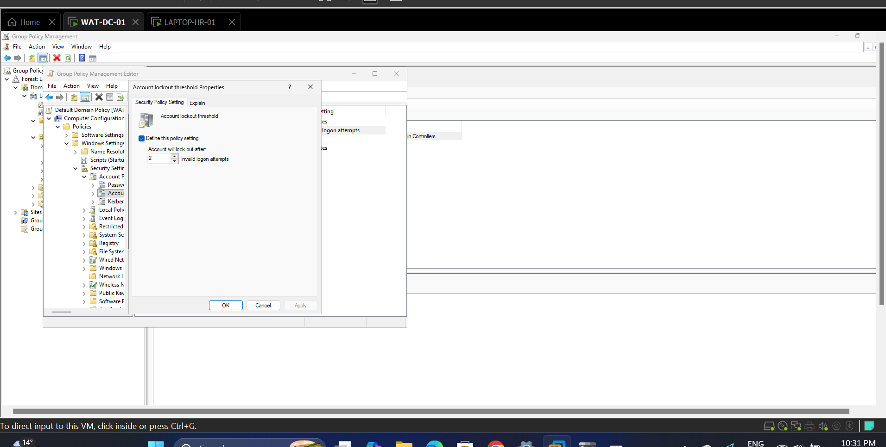
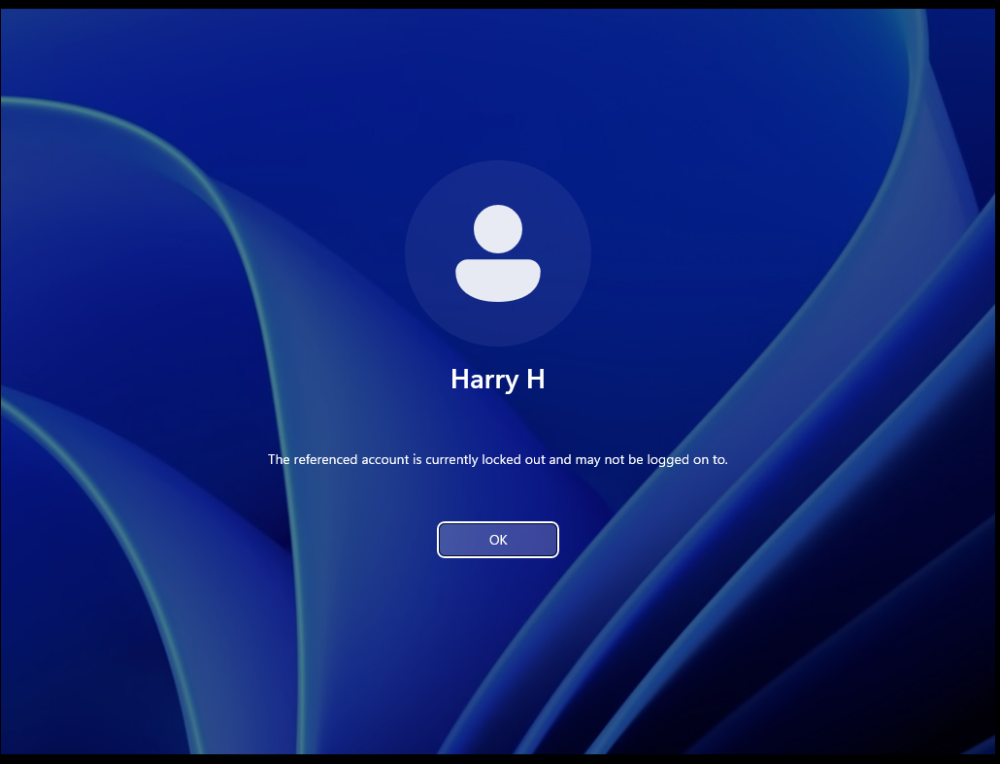
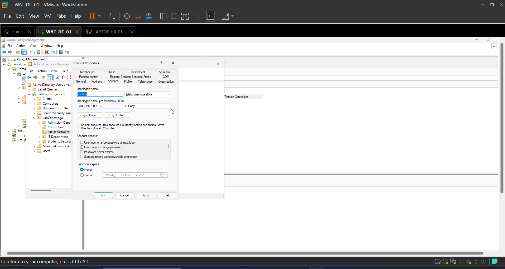
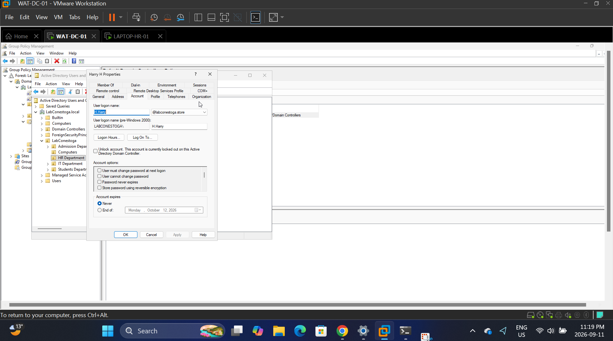
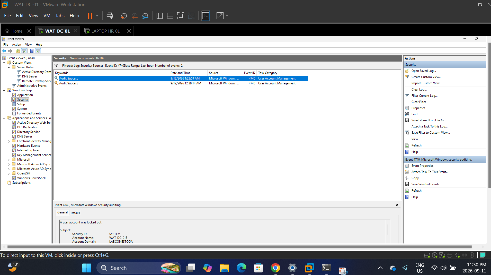
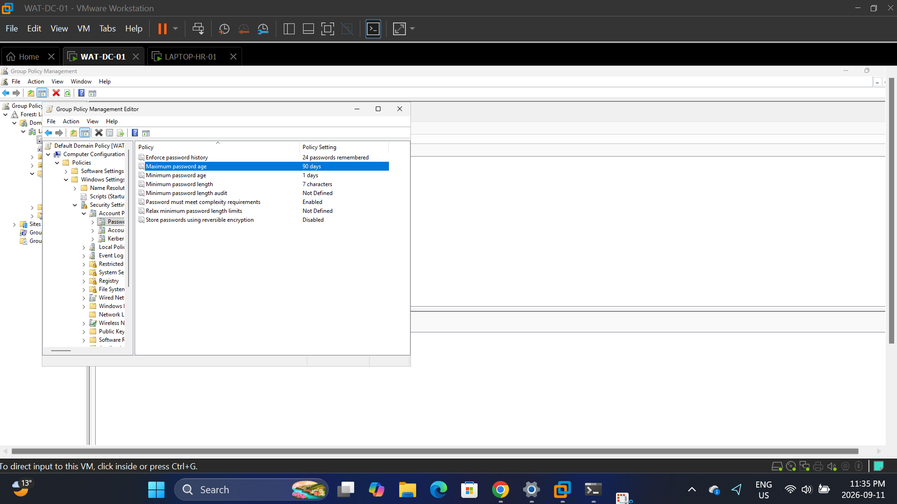
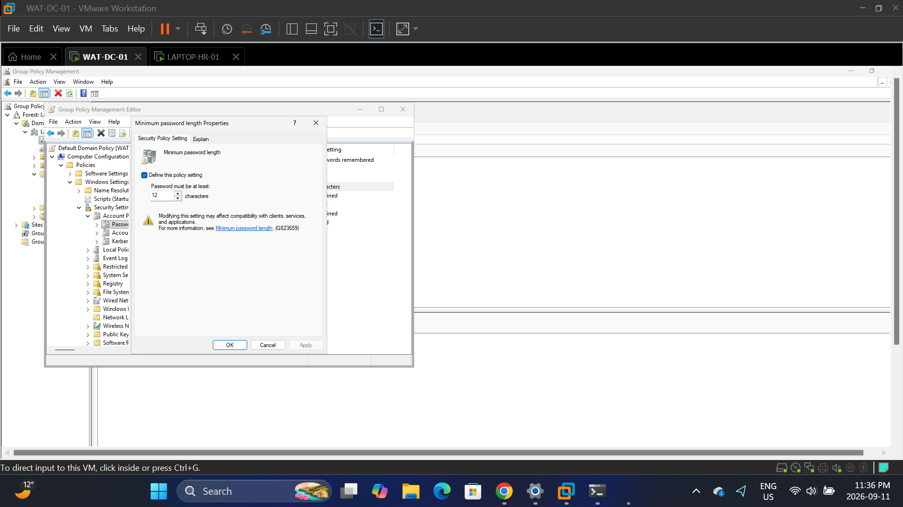
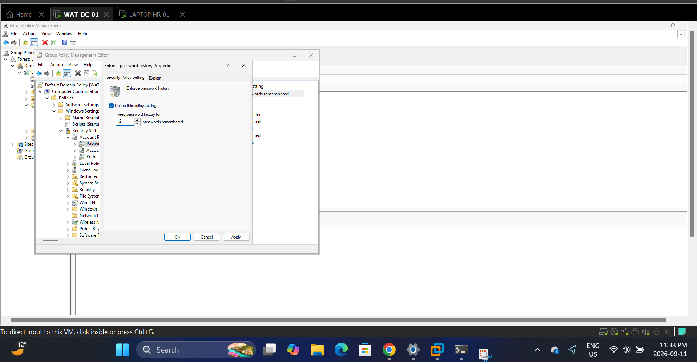

# Project 2 – Group Policy Management

**Role simulated:** System Administrator
**Environment:** Windows Server (AD DS + GPMC) in VMware Workstation, managing a domain-joined client (LAPTOP-HR-01)

## Overview
This project covers using Group Policy to enforce organization-wide configuration and security settings across the LabConestoga domain — deploying a standard desktop wallpaper, enforcing an account lockout policy, and tightening password requirements — then verifying each policy actually took effect on a client machine.

## Skills demonstrated
- Group Policy Management Console (GPMC): creating and linking GPOs
- Desktop configuration deployment (wallpaper policy)
- Account lockout policy configuration and testing
- Password policy hardening (minimum length, history, complexity)
- Windows Event Viewer: security auditing and event correlation
- Active Directory Users and Computers (ADUC): account unlock workflow

## Walkthrough

### 1. Configured the wallpaper deployment GPO
Enabled the Desktop Wallpaper policy setting and pointed it to a shared wallpaper file, set to "Fill" style.

### 2. Verified the GPO was created
Confirmed the "Deploy-Wallpaper" GPO appeared as Enabled in the Group Policy Management console.

### 3. Verified the wallpaper deployed on the client
Checked the client machine (LAPTOP-HR-01) and confirmed the policy-pushed wallpaper was applied on the desktop.

### 4. Configured account lockout threshold
Set the domain account lockout policy to lock an account after 2 invalid logon attempts.

### 5. Verified the lockout policy was enforced
Intentionally triggered the lockout by attempting invalid logons, confirming the account was locked out at sign-in.

### 6. Viewed the locked account status in ADUC
Opened the user's account properties in Active Directory Users and Computers to confirm the lockout status.

### 7. Unlocked the account
Used the "Unlock account" option in ADUC to restore access for the locked-out user.

### 8. Verified the lockout event in Event Viewer
Filtered the Security log for Event ID 4740 to confirm the lockout was logged and auditable.

### 9. Reviewed the domain password policy
Reviewed the Default Domain Policy's password settings (history, age, length, complexity) before hardening them.

### 10. Configured minimum password length
Set the minimum password length requirement to 12 characters.

### 11. Configured password history
Set the password history policy to remember the last 12 passwords, preventing reuse.

## What I learned
Working through account lockout end-to-end — configuring the threshold, deliberately triggering it, then tracing the resulting event in the Security log — made it clear how these pieces connect in a real support ticket: a locked-out user calling in maps directly to Event ID 4740, and knowing where to look cuts troubleshooting time significantly. Tightening the password policy also underlined the trade-off support teams manage constantly: stronger security requirements (12-character minimum, 12-password history) versus the support burden of more frequent "I forgot my password" tickets.

