# Project 3 – File Server Management

**Role simulated:** System Administrator
**Environment:** Windows Server file server (Active Directory Domain Services, File and Storage Services) and Windows 11 client, domain-joined to the LabConestoga domain, virtualized in VMware Workstation.

## Overview
This project sets up a centralized file server for a simulated organization, with departmental folders (Admission, HR, IT, Students) secured through NTFS permissions tied to dedicated Active Directory security groups. It also covers deploying network drives automatically through Group Policy, hiding inaccessible folders with Access-Based Enumeration, and enabling Shadow Copies so users can recover previous file versions themselves.

## Skills demonstrated
- Disk and volume management for dedicated file storage (Disk Management)
- Designing a departmental folder structure for centralized file storage
- NTFS permissions configuration using Active Directory security groups (least-privilege access)
- SMB file share creation and share-level permission configuration
- Access control validation through positive and negative access testing
- Group Policy Preferences (Drive Maps) for automated network drive deployment
- Access-Based Enumeration (ABE) to hide unauthorized folders from users
- Volume Shadow Copy Service (VSS) configuration and scheduling
- File recovery via Previous Versions on a client machine
- Server Manager – File and Storage Services administration

## Walkthrough
### 1. Initialized a new volume for file storage
Used Disk Management on the file server to confirm a second disk had been added and initialized as the U: drive, providing dedicated storage separate from the OS drive.
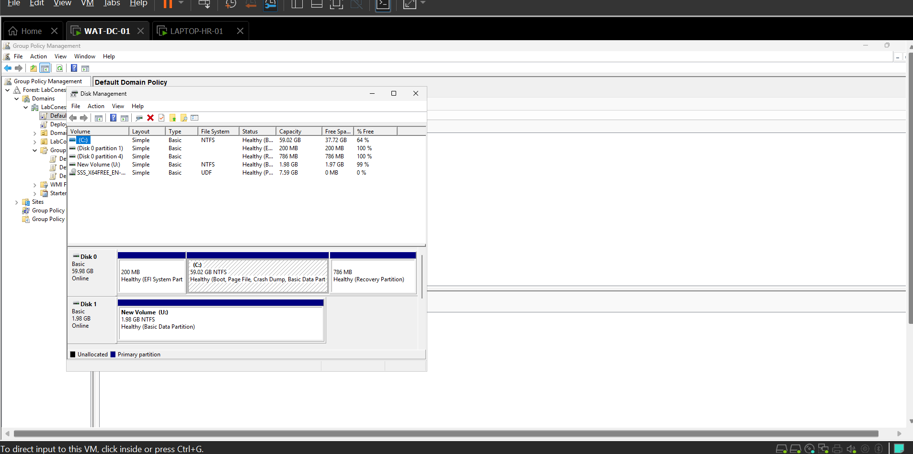

### 2. Created the departmental folder structure
Built a LabConestoga root folder on the U: drive containing four department subfolders — Admission, HR, IT, and Students — to organize shared data by business unit.
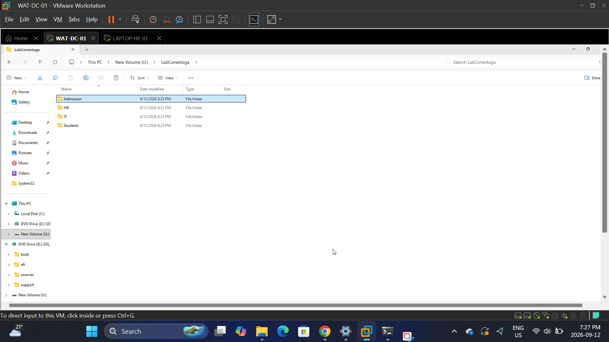

### 3. Reviewed default NTFS permissions
Opened the Advanced Security Settings for the Admission folder to inspect the default inherited permissions (Administrators, SYSTEM, CREATOR OWNER, and the generic Users group) before customizing access.
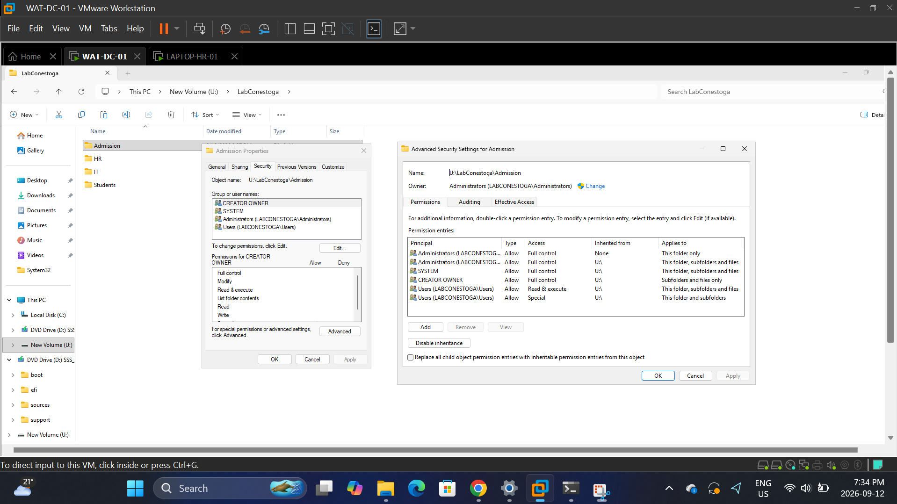

### 4–7. Assigned NTFS permissions to each department folder
Replaced the generic Users group on each department folder with a dedicated Active Directory security group (Admission_Team, HR_Team, IT_Team, Students_Team) and granted Modify access, applying least-privilege access control per department.
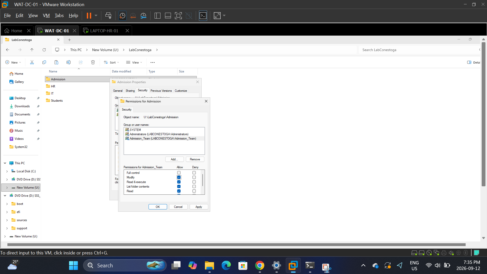
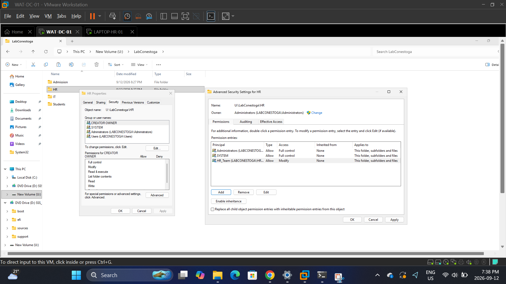
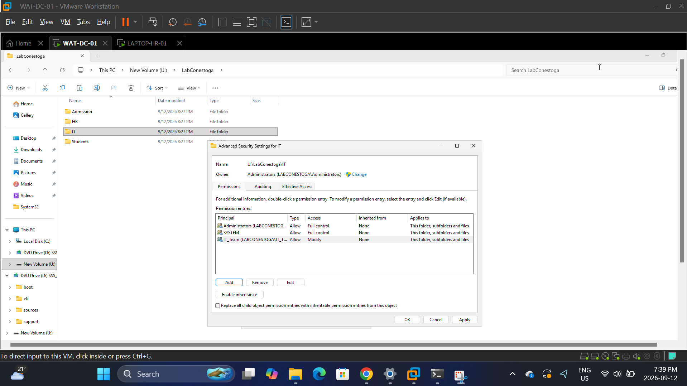
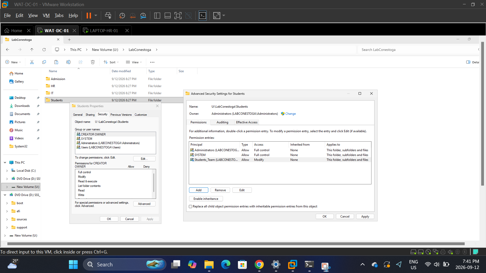

### 8. Shared the folder and set share permissions
Shared the LabConestoga folder over the network and configured share-level permissions, granting Authenticated Users Change and Read access at the share level, with NTFS permissions remaining the more restrictive layer underneath.
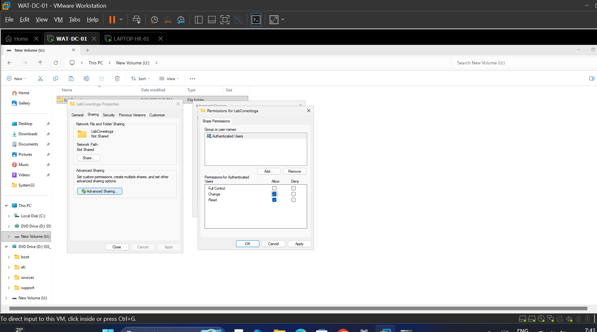

### 9. Tested denied access from a client machine
Logged in as Harry, a member of the HR_Team security group, and attempted to access the Admission folder over the network from the client machine. Windows correctly blocked the connection with a permissions error, confirming that Harry's HR group membership did not extend to Admission's resources.
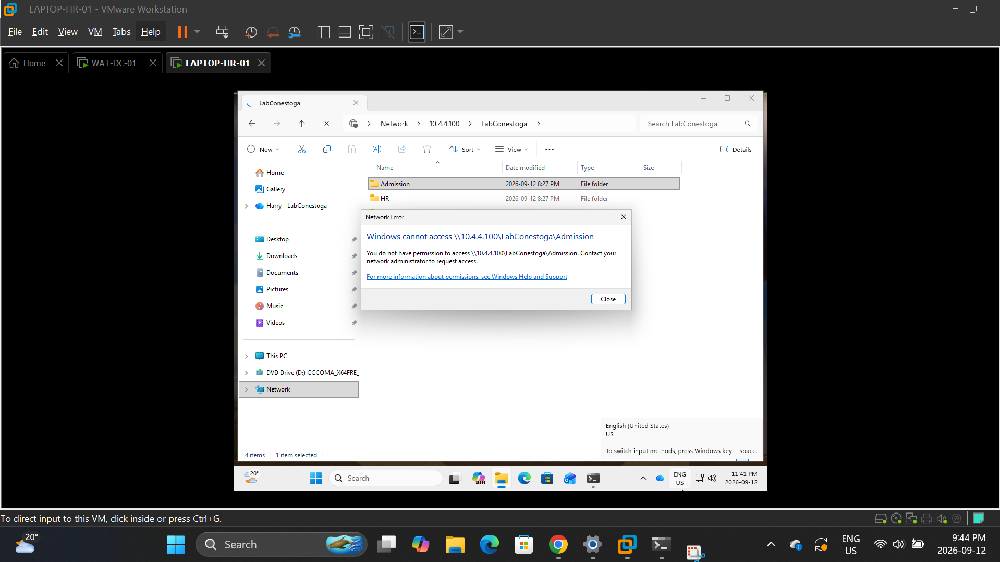

### 10. Tested granted access from a client machine
Using the same Harry (HR_Team) account, confirmed successful access to the HR folder and its contents, validating that NTFS and share permissions were correctly scoped so the right group membership grants the right access — and nothing more.
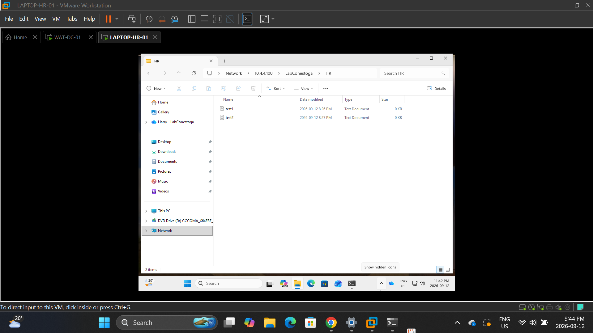

### 11. Verified a manually mapped network drive
Mapped the LabConestoga share to a drive letter on the client and confirmed it appeared under Network locations, as a baseline before automating the process with Group Policy.
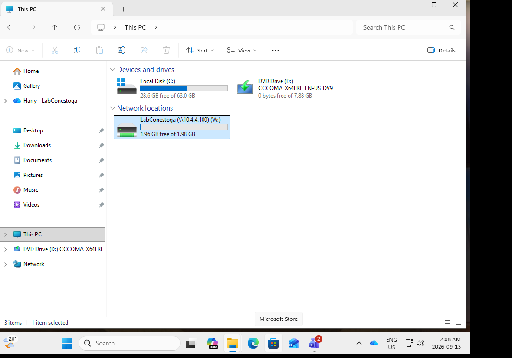

### 12. Configured GPO-based drive mapping
Created a Group Policy Preference (Drive Maps) to automatically map the LabConestoga share to a drive letter labelled "Company Drive" for domain-joined clients.
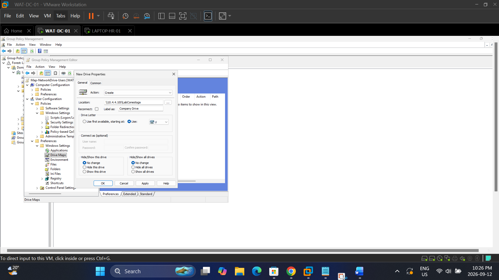

### 13. Verified GPO drive mapping on the client
Confirmed the Group Policy applied successfully, with the Company Drive appearing automatically on the client alongside the manually mapped drive.
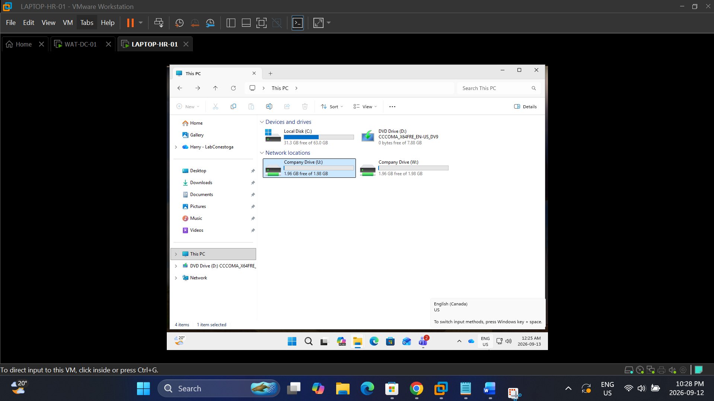

### 14. Browsed the company drive contents
Opened the GPO-mapped Company Drive on the client and confirmed all four department folders were visible and accessible as expected.

### 15. Enabled Access-Based Enumeration
Enabled Access-Based Enumeration (ABE) on the LabConestoga share in Server Manager so that users only see folders they actually have permission to access.
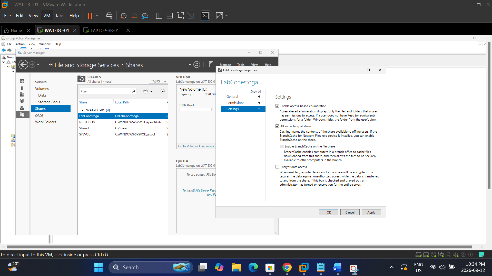

### 16. Verified Access-Based Enumeration
Reconnected as Harry (HR_Team) and confirmed that only the HR folder was now visible on the Company Drive, with the other department folders hidden entirely rather than just showing as access-denied.
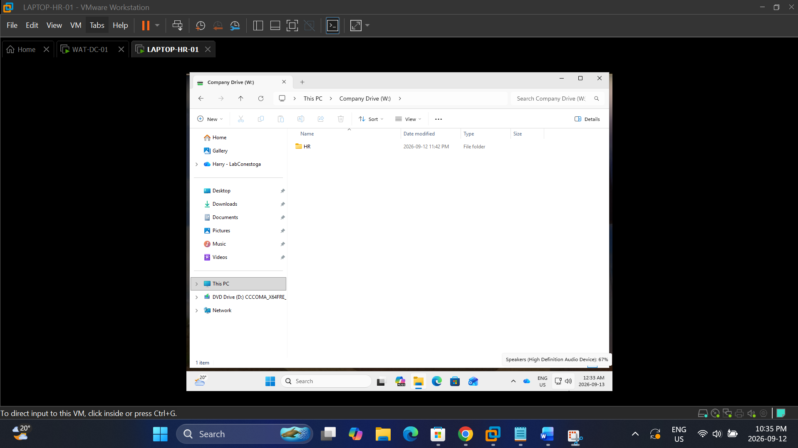

### 17. Configured Shadow Copies for the data volume
Enabled and scheduled Volume Shadow Copy Service (VSS) on the U: volume to run automatically on weekdays, providing point-in-time recovery for shared files.
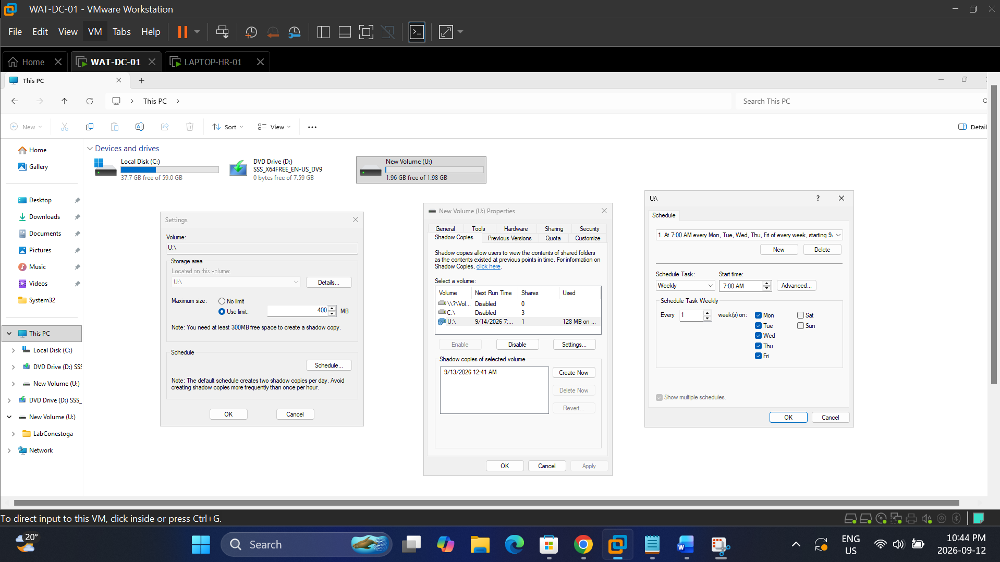

### 18. Verified Previous Versions on the client
Confirmed from the client machine that a restore point appeared under the Previous Versions tab of the Company Drive, allowing end users to recover earlier file versions without administrator intervention.
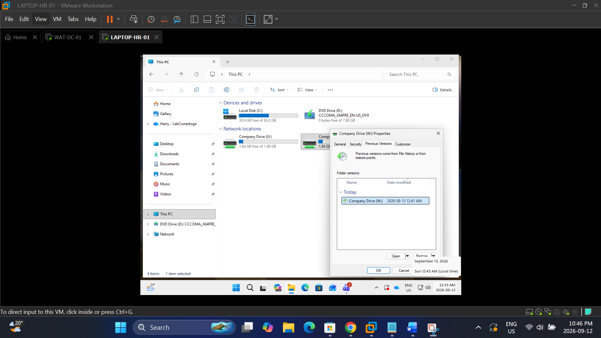

## What I learned
This project made the difference between NTFS and share permissions click in a way reading about it never did — actually watching the same test account get blocked from Admission but land right in HR showed me how the two layers stack, rather than just memorizing which one is "more restrictive." Access-Based Enumeration was the part I found most interesting: it's a small setting, but the difference between "access denied" and "the folder doesn't even appear" matters a lot for how a real environment feels to end users. Setting up and then actually restoring from Shadow Copies also reframed backups for me — it's not just a disaster-recovery checkbox, it's a self-service feature that saves a help desk ticket every time someone overwrites a file by accident.
