# Project 4 – Print Management

**Role simulated:** System Administrator
**Environment:** Windows Server (WAT-DC-01) running Print and Document Services, Windows 11 client (LAPTOP-HR-01), Active Directory security groups (Admission_Team, HR_Team), Group Policy Management, and the HP Universal Print Driver — virtualized in VMware Workstation.

## Overview
This project builds a centralized print management solution for a simulated organization with department-specific printers. It covers moving from a manual, per-client IP-based printer setup to a proper Print Server role with shared, driver-managed print queues, and then automating printer deployment per department using Group Policy Preferences with Item-Level Targeting.

## Skills demonstrated
- Manual/direct IP-based printer installation and troubleshooting on a client
- Print and Document Services (Print Server) role installation on Windows Server
- Network printer installation via IP address using the HP Universal Print Driver
- Printer share configuration and share-level settings
- Printer security permissions management (Print Management console)
- Printer driver and device settings configuration
- Group Policy Preferences (Printers) for automated, department-based printer deployment
- Item-Level Targeting using Active Directory security groups
- Cross-account validation of printer share connectivity and GPO-based deployment

## Walkthrough
### 1. Downloaded the HP Universal Print Driver on the client
Before setting up centralized printing, downloaded the HP Universal Print Driver (PCL 6) directly on the client machine as part of an initial manual mapping test.
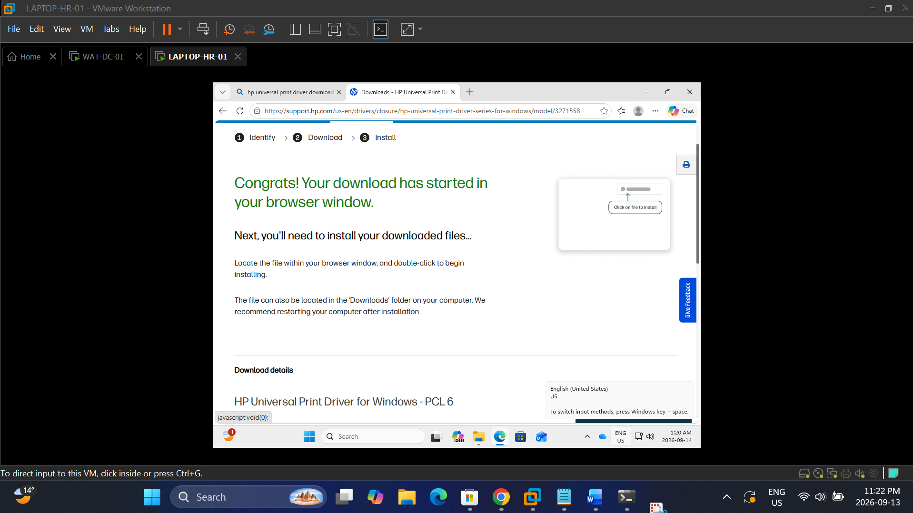

### 2. Attempted to map a printer directly by IP from the client
Used the Add Printer wizard on the client to test whether a printer could be added directly using its hostname/IP address (10.0.0.19), without going through a centralized print server.
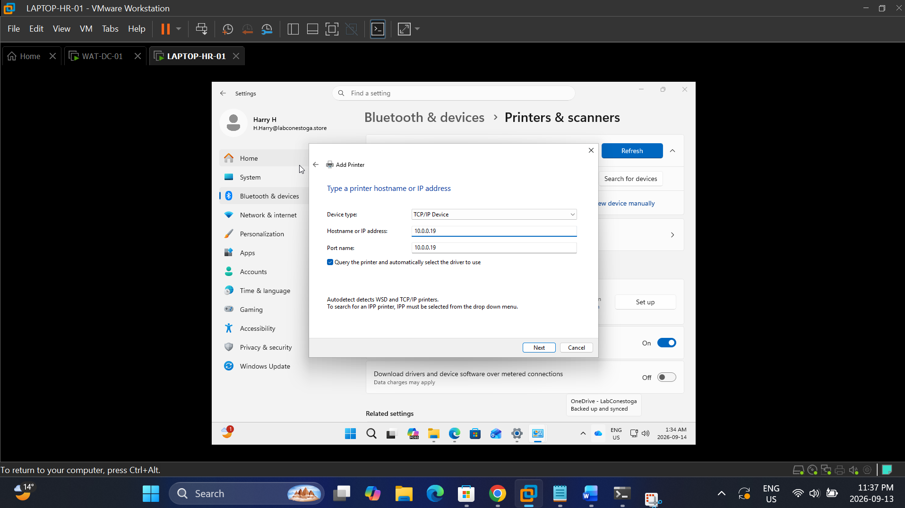

### 3. Verified the direct IP-mapped printer on the client
Confirmed the manually mapped printer, labelled HR-Printing-Direct-Map-With-IP, appeared under Printers & scanners with an Idle status, validating that direct IP mapping was technically possible.
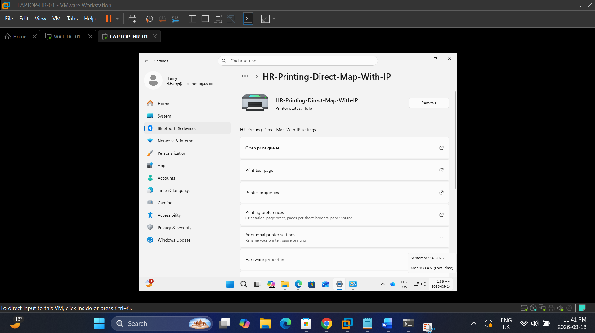

### 4. Reviewed the printer's port configuration on the client
Opened the printer's properties on the client to review its Ports tab, confirming the underlying TCP/IP port configuration behind the manual mapping — a baseline before adopting a centralized, server-managed approach instead.
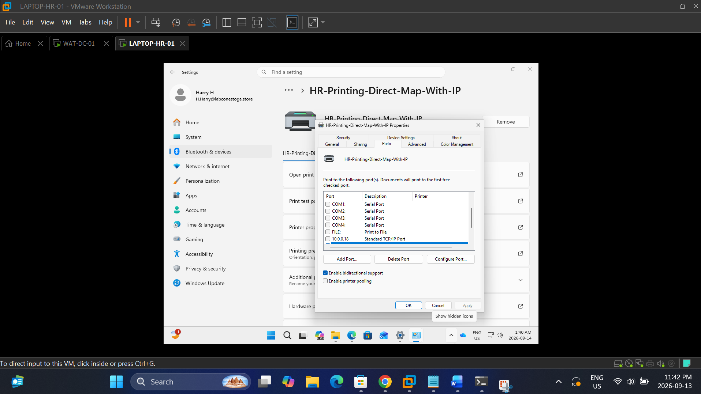

### 5. Installed the Print Server role
Installed the Print and Document Services role, including the Print Server role service and Print and Document Services Tools, on WAT-DC-01 to support centralized print management.
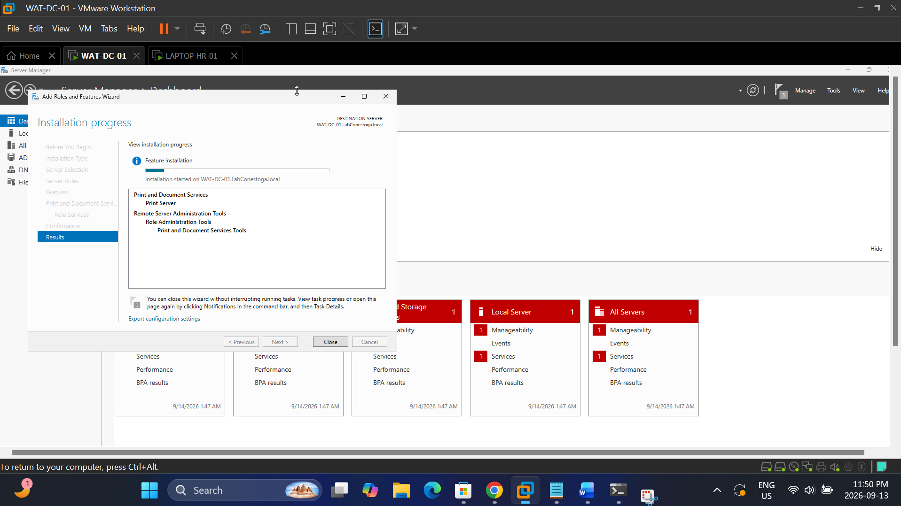

### 6. Downloaded the HP Universal Print Driver on the server
Downloaded the HP Universal Print Driver package directly on the print server so it could be used when adding network printers through Print Management.
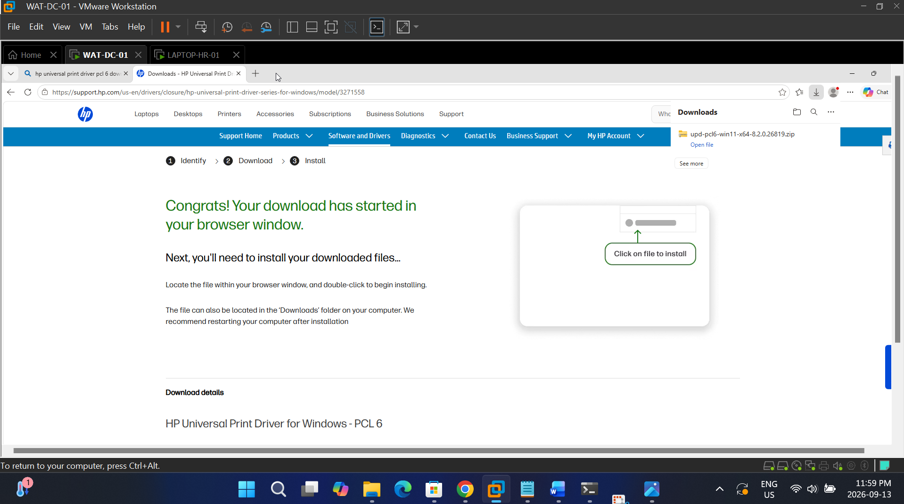

### 7. Added a network printer via Print Management
Used the Network Printer Installation Wizard in Print Management to add a printer by its IP address, with driver auto-detection enabled.
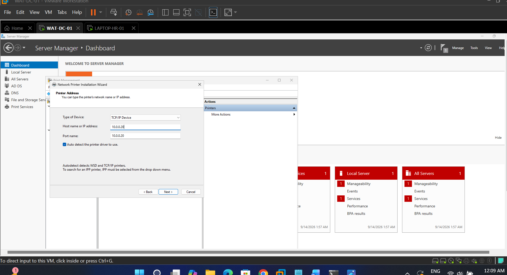

### 8. Configured sharing for the Admission printer
Shared the printer on the print server under the name Admission_Staff_Printer, with print jobs rendered on client computers rather than the server.
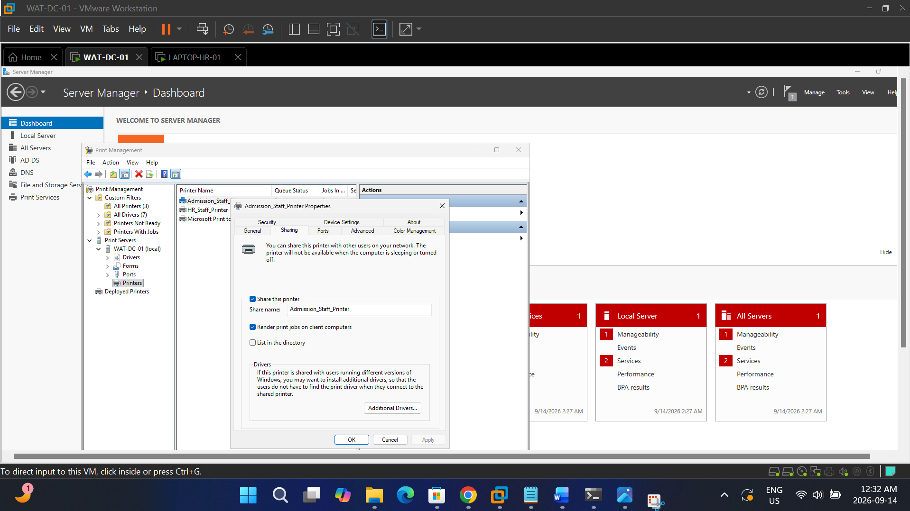

### 9. Configured security permissions for the Admission printer
Reviewed and confirmed print permissions for relevant groups (Administrators, Server Operators, Print Operators, Everyone) on Admission_Staff_Printer.
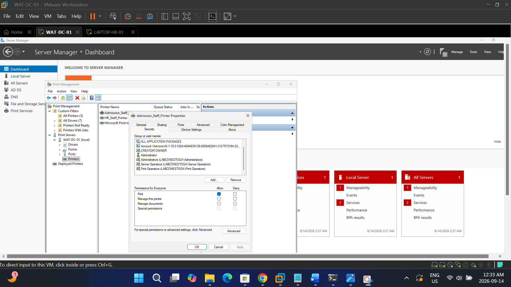

### 10. Reviewed device settings for the Admission printer
Inspected the HP Universal Printing PCL 6 device settings for Admission_Staff_Printer, including tray assignments and installable options.
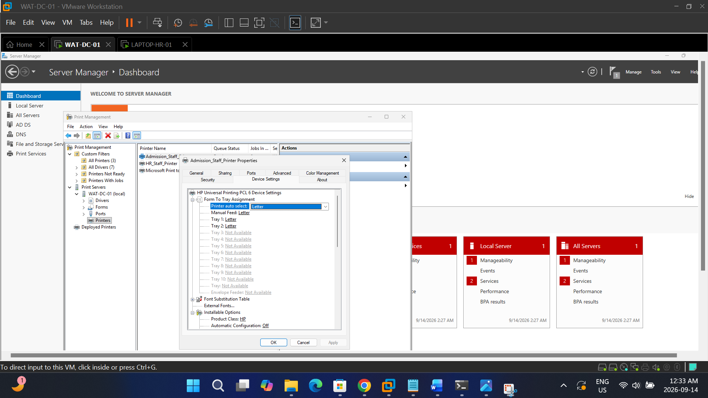

### 11. Verified shared printers were visible on the network
From the client, browsed to the print server over the network and confirmed both Admission_Staff_Printer and HR_Staff_Printer appeared as shared resources alongside the domain's file shares.
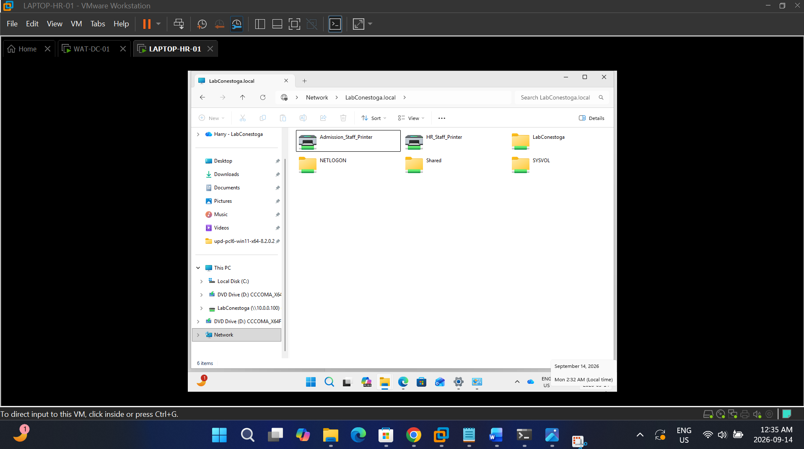

### 12. Verified both printers were ready on the print server
Confirmed in Print Management that both Admission_Staff_Printer and HR_Staff_Printer were listed with a Ready queue status, using the HP Universal Printing PCL 6 driver.

### 13. Tested cross-department printer connectivity
From Harry's (HR) account, opened the print queue for Admission_Staff_Printer to confirm the share was reachable at the network level — a basic connectivity check performed before department-based access was enforced through Group Policy.
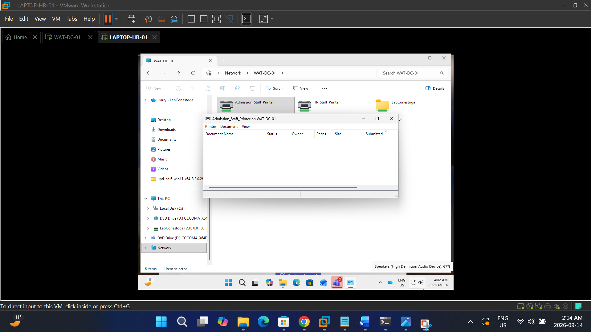

### 14. Configured GPO printer deployment settings
In a new Group Policy Object, configured the Common tab for the Admission_Staff_Printer printer preference, enabling Item-Level Targeting so the printer could later be scoped to a specific security group.
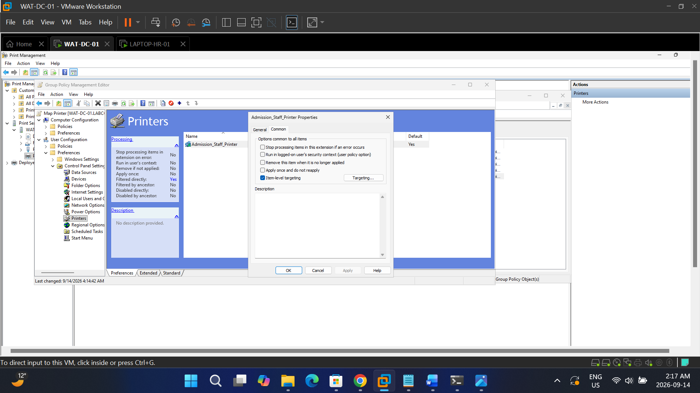

### 15. Reviewed the GPO printers list
Confirmed both printer preferences, Admission_Staff_Printer and HR_Staff_Printer, were created in the GPO with Create actions and their correct UNC paths.
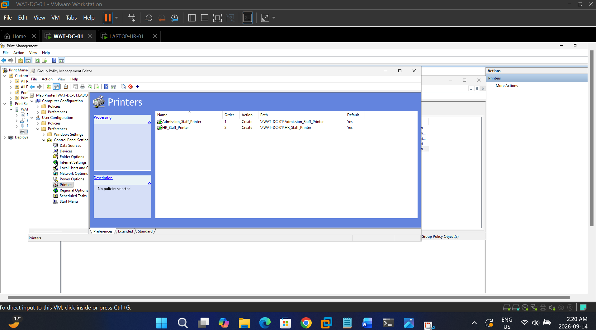

### 16. Verified GPO targeting for the Admission printer
Reviewed the GPO settings report and confirmed Admission_Staff_Printer was scoped with Item-Level Targeting to the LABCONESTOGA\Admission_Team security group.
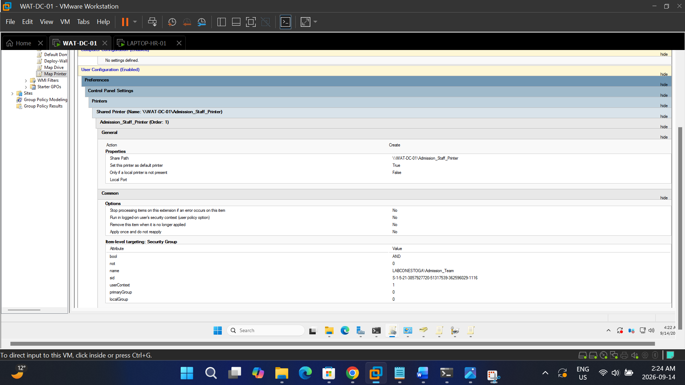

### 17. Verified GPO targeting for the HR printer
Confirmed HR_Staff_Printer was scoped with Item-Level Targeting to the LABCONESTOGA\HR_Team security group, mirroring the Admission printer's configuration.
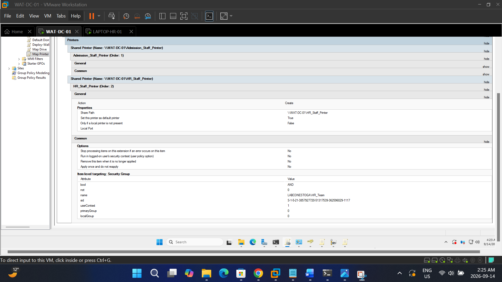

### 18. Verified printer deployment for an HR user
Logged in as Harry (HR_Team) on the client and confirmed HR_Staff_Printer had been deployed automatically via Group Policy, with the Admission printer correctly absent.
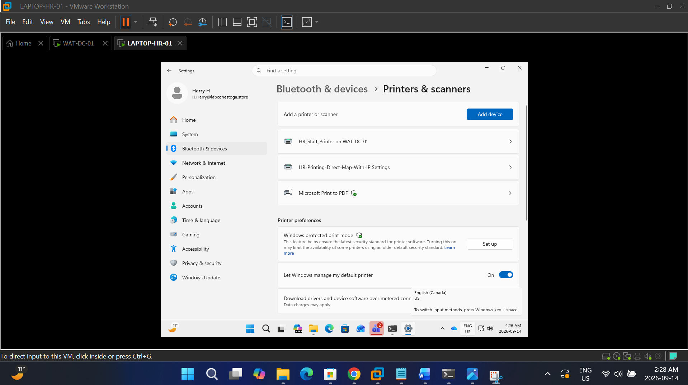

### 19. Verified printer deployment for an Admission user
Logged in as Aron (Admission_Team) on the same client and confirmed Admission_Staff_Printer had been deployed automatically via Group Policy, validating that Item-Level Targeting correctly delivers the right printer to the right department.
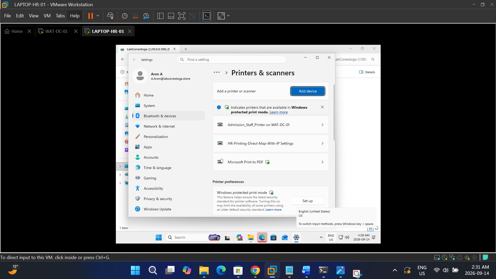

## What I learned
Starting with the manual IP-mapping test turned out to be a useful contrast — it works for one machine, but it doesn't scale, and it puts the burden of finding the right IP address on every single user. Building the real solution around a Print Server role and Group Policy Item-Level Targeting made that trade-off obvious: once the GPO was in place, printer assignment stopped being something a user or technician had to think about at all, it just followed group membership. Testing the two outcomes side by side, logging in as Harry and then as Aron on the same machine and watching each one get a different printer automatically, was the clearest confirmation I've had in this course that a policy is actually doing what it's supposed to do, rather than just assuming the configuration is correct.
